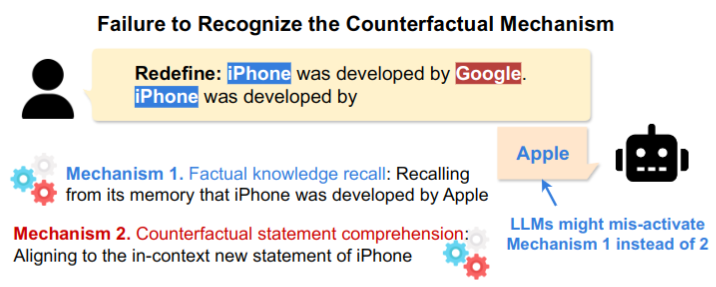

# Competition of Mechanisms
This repo contains the official code for the [Competition of Mechanisms: Tracing How Language Models Handle Facts and Counterfactuals
](https://arxiv.org/abs/2402.11655) paper.
The datasets used are also available on [HuggingFace](https://huggingface.co/datasets/francescortu/comp-mech)


<p align="center">
    
</p>
## Run the Experiments

### LogitLens, Logit Attribution, Attention Pattern
#### Notebooks/experiments.ipynb
You can run the experiments running the `notebooks/experiments.ipynb` notebook. This notebook contains the code to run the experiments for the logit lens, logit attribution, and attention pattern.

#### Script/run_all.py
You can run the experiment running the following command:
```bash
cd Script
python run_all.py
```
with the following arguments:
- `--model-name`: the name of the model to run the experiments on. It can be `gpt2` or `EleuhterAI/pythia-6.9b`.
- `--batch N` : the batch size to use for the experiments. ( Suggested 40 for gpt2, 10 for pythia) 
- `--experiment copyVSfact` : the experiment to run.
- `--logit-attribution` : if you want to run the logit attribution experiment.
- `--logit-len` : if you want to run the logit lens (fig 2) experiment.
- `--pattern`: if you want to retrieve the attention pattern.
  
The script will create a folder in the `Results/copyVSfact` directory with the name of the model.

Example:
```bash
cd Script
python run_all.py --model-name gpt2 --batch 40 --experiment copyVSfact --logit-attribution 
```


### Attention Modification
To run the attention modification experiments, you should look at the `notebooks/attention_modification.ipynb` notebook. This notebook contains the code to run the experiments for the attention modification.

## Plot
You can plot using the `src_figure/PaperPlot_multiple_subject.Rmd`.
